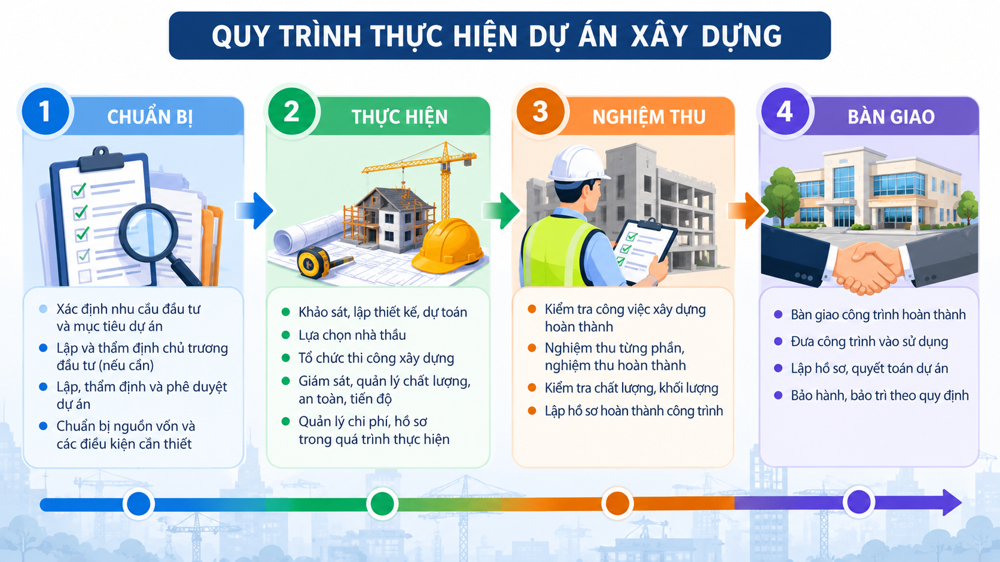

# Giới thiệu

## 1. Tên đề tài

**XÂY DỰNG WEBSITE QUY TRÌNH, THỦ TỤC DỰ ÁN XÂY DỰNG**

## 2. Bài toán giải quyết

Website được xây dựng nhằm hệ thống hóa các bước, trình tự và thủ tục
cơ bản trong quá trình thực hiện một dự án xây dựng.

Nội dung được trình bày dưới dạng tài liệu trực tuyến, giúp người sử dụng
dễ dàng tra cứu theo từng giai đoạn của dự án.

## 3. Mục tiêu

- Hệ thống hóa quy trình thực hiện dự án xây dựng.

## 4. Các giai đoạn chính

| STT | Giai đoạn | Nội dung |
|---:|---|---|
| 1 | Chuẩn bị | Xác định nhu cầu và chuẩn bị dự án |
| 2 | Thực hiện | Thiết kế, lựa chọn nhà thầu và thi công |
| 3 | Nghiệm thu | Kiểm tra, nghiệm thu và hoàn thành |
| 4 | Bàn giao | Bàn giao công trình và đưa vào sử dụng |

## 5. Sơ đồ quy trình thực hiện dự án

> **Lưu ý:** Website mang tính chất tham khảo và thực hiện đồ án
